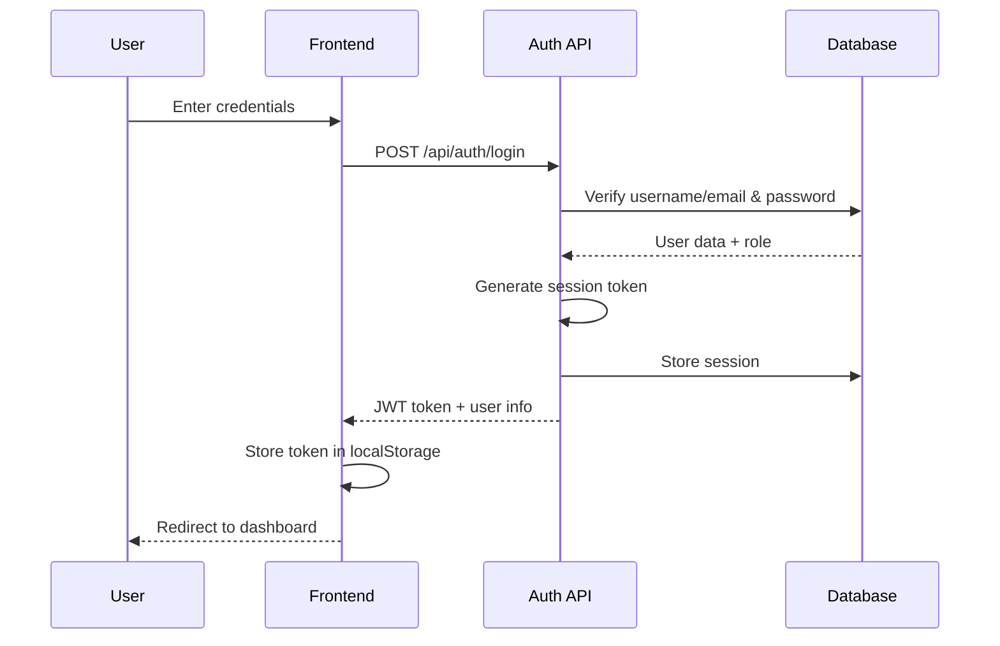
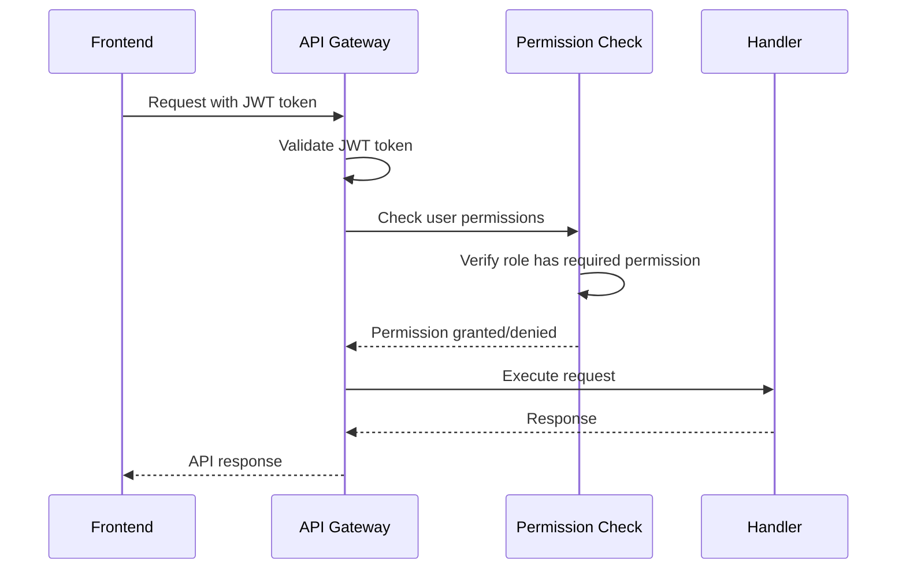

# 🔐 AnimaID Authentication System

## Overview

The AnimaID authentication system provides secure access control for technical accounts and AnimaID staff members. External users (parents/families) do not require accounts and access the system through public interfaces only. The system implements a flexible role-based access control (RBAC) model where users can be assigned multiple roles, with permissions being additive across all assigned roles. This allows for non-linear access patterns where staff can have specialized permissions regardless of their primary role level.

## Database Schema

### Core Tables

#### users
```sql
CREATE TABLE users (
    id INTEGER PRIMARY KEY AUTOINCREMENT,
    username VARCHAR(50) UNIQUE NOT NULL,
    email VARCHAR(255) UNIQUE NOT NULL,
    password_hash VARCHAR(255) NOT NULL,
    is_active BOOLEAN DEFAULT 1,
    created_at DATETIME DEFAULT CURRENT_TIMESTAMP,
    updated_at DATETIME DEFAULT CURRENT_TIMESTAMP,
    last_login DATETIME NULL
);
```

#### user_roles
```sql
CREATE TABLE user_roles (
    id INTEGER PRIMARY KEY AUTOINCREMENT,
    user_id INTEGER NOT NULL,
    role_id INTEGER NOT NULL,
    assigned_at DATETIME DEFAULT CURRENT_TIMESTAMP,
    assigned_by INTEGER, -- User ID who assigned the role
    is_primary BOOLEAN DEFAULT 0, -- Primary role for UI display
    FOREIGN KEY (user_id) REFERENCES users(id) ON DELETE CASCADE,
    FOREIGN KEY (role_id) REFERENCES roles(id) ON DELETE CASCADE,
    FOREIGN KEY (assigned_by) REFERENCES users(id),
    UNIQUE(user_id, role_id)
);
```

#### roles
```sql
CREATE TABLE roles (
    id INTEGER PRIMARY KEY AUTOINCREMENT,
    name VARCHAR(50) UNIQUE NOT NULL,
    display_name VARCHAR(100) NOT NULL,
    description TEXT,
    is_system_role BOOLEAN DEFAULT 0, -- Cannot be deleted
    created_at DATETIME DEFAULT CURRENT_TIMESTAMP
);
```

#### permissions
```sql
CREATE TABLE permissions (
    id INTEGER PRIMARY KEY AUTOINCREMENT,
    name VARCHAR(100) UNIQUE NOT NULL,
    display_name VARCHAR(150) NOT NULL,
    description TEXT,
    module VARCHAR(50) NOT NULL, -- e.g., 'registrations', 'calendar', 'communications'
    created_at DATETIME DEFAULT CURRENT_TIMESTAMP
);
```

#### role_permissions
```sql
CREATE TABLE role_permissions (
    id INTEGER PRIMARY KEY AUTOINCREMENT,
    role_id INTEGER NOT NULL,
    permission_id INTEGER NOT NULL,
    granted_at DATETIME DEFAULT CURRENT_TIMESTAMP,
    granted_by INTEGER, -- User ID who granted the permission
    FOREIGN KEY (role_id) REFERENCES roles(id) ON DELETE CASCADE,
    FOREIGN KEY (permission_id) REFERENCES permissions(id) ON DELETE CASCADE,
    FOREIGN KEY (granted_by) REFERENCES users(id),
    UNIQUE(role_id, permission_id)
);
```

#### user_sessions
```sql
CREATE TABLE user_sessions (
    id INTEGER PRIMARY KEY AUTOINCREMENT,
    user_id INTEGER NOT NULL,
    session_token VARCHAR(255) UNIQUE NOT NULL,
    ip_address VARCHAR(45),
    user_agent TEXT,
    expires_at DATETIME NOT NULL,
    created_at DATETIME DEFAULT CURRENT_TIMESTAMP,
    FOREIGN KEY (user_id) REFERENCES users(id) ON DELETE CASCADE
);
```

#### password_resets
```sql
CREATE TABLE password_resets (
    id INTEGER PRIMARY KEY AUTOINCREMENT,
    user_id INTEGER NOT NULL,
    reset_token VARCHAR(255) UNIQUE NOT NULL,
    expires_at DATETIME NOT NULL,
    used BOOLEAN DEFAULT 0,
    created_at DATETIME DEFAULT CURRENT_TIMESTAMP,
    FOREIGN KEY (user_id) REFERENCES users(id) ON DELETE CASCADE
);
```

## Role System

### System Roles (Pre-defined)

1. **Technical Admin**
   - Full system access
   - Can manage centers, users, roles, and system settings
   - Can access all modules and applets

2. **Organizzatore**
   - Center organization and high-level management
   - Can manage staff, activities, and major decisions

3. **Responsabile**
   - Department or activity line responsibility
   - Can manage assigned activities and subordinate staff

4. **Animatore**
   - Activity animator role
   - Can manage specific activities and child interactions

5. **Aiutoanimatore**
   - Assistant animator
   - Limited access to activity management and basic functions

### Flexible Role Assignment

- Users can be assigned multiple roles simultaneously
- Each role grants specific permissions to different sections
- Permissions are **additive** - a user gets all permissions from all their assigned roles
- Non-linear access patterns are supported:
  - A high-level manager might not need access to certain specialized sections
  - A junior staff member might need access to specific high-level functions
  - Roles can be combined for customized access profiles


## Permission Categories

### Core Module Permissions

#### Registrations & Records
- `registrations.view` - View child registrations
- `registrations.create` - Create new registrations
- `registrations.edit` - Edit existing registrations
- `registrations.delete` - Delete registrations
- `registrations.approve` - Approve pending registrations

#### Calendar Management
- `calendar.view` - View calendar events
- `calendar.create` - Create calendar events
- `calendar.edit` - Edit calendar events
- `calendar.delete` - Delete calendar events
- `calendar.publish` - Publish events to public calendar

#### Attendance & Shifts
- `attendance.view` - View attendance records
- `attendance.checkin` - Perform check-in/check-out
- `attendance.edit` - Edit attendance records
- `attendance.report` - Generate attendance reports

#### Communications
- `communications.view` - View internal communications
- `communications.send` - Send internal messages
- `communications.broadcast` - Send broadcast messages
- `communications.manage` - Manage communication settings

#### Media Management
- `media.view` - View media files
- `media.upload` - Upload media files
- `media.approve` - Approve media for publication
- `media.delete` - Delete media files

#### Wiki/Games Database
- `wiki.view` - View wiki content
- `wiki.edit` - Edit wiki content
- `wiki.create` - Create new wiki entries
- `wiki.moderate` - Moderate user feedback

#### Space Booking
- `spaces.view` - View space bookings
- `spaces.book` - Create space bookings
- `spaces.edit` - Edit space bookings
- `spaces.manage` - Manage space configurations

#### Reporting & Analytics
- `reports.view` - View reports and KPIs
- `reports.generate` - Generate custom reports
- `reports.export` - Export report data

#### System Administration
- `admin.users` - Manage users
- `admin.roles` - Manage roles and permissions
- `admin.system` - System configuration
- `admin.backup` - Backup and restore

## Authentication Flow

### Login Process



### API Request Flow



### Session Management

1. **Token Generation**: JWT tokens with user ID, role, and expiration
2. **Session Storage**: Server-side session tracking for security
3. **Token Refresh**: Automatic refresh before expiration
4. **Logout**: Invalidate both client and server sessions

## Security Measures

### Password Security
- Bcrypt hashing with cost factor 12
- Minimum 8 characters, complexity requirements
- Password reset via email tokens

### Session Security
- JWT tokens with short expiration (1 hour)
- Refresh tokens for extended sessions
- IP address tracking
- Automatic logout on suspicious activity

### API Security
- Rate limiting per user/IP
- Input validation and sanitization
- CORS configuration
- HTTPS enforcement

### Permission Checks
- Middleware-based permission validation
- Granular permission system
- Audit logging for sensitive operations

## Implementation in PHP

### Basic Auth Class Structure

```php
class Auth {
    private $db;
    private $jwt_secret;

    public function __construct(PDO $db) {
        $this->db = $db;
        $this->jwt_secret = getenv('JWT_SECRET');
    }

    public function login(string $username, string $password): array {
        // Verify credentials
        // Generate JWT token
        // Create session record
        // Return token and user data
    }

    public function verifyToken(string $token): array {
        // Decode and verify JWT
        // Check session validity
        // Return user data or throw exception
    }

    public function checkPermission(int $userId, string $permission): bool {
        // Get all user roles
        $stmt = $this->db->prepare("
            SELECT r.id, r.name
            FROM roles r
            INNER JOIN user_roles ur ON r.id = ur.role_id
            WHERE ur.user_id = ?
        ");
        $stmt->execute([$userId]);
        $userRoles = $stmt->fetchAll(PDO::FETCH_ASSOC);

        if (empty($userRoles)) {
            return false;
        }

        // Check if any role has the permission
        $roleIds = array_column($userRoles, 'id');
        $placeholders = str_repeat('?,', count($roleIds) - 1) . '?';

        $stmt = $this->db->prepare("
            SELECT COUNT(*) as count
            FROM role_permissions rp
            INNER JOIN permissions p ON rp.permission_id = p.id
            WHERE rp.role_id IN ($placeholders) AND p.name = ?
        ");
        $stmt->execute(array_merge($roleIds, [$permission]));

        return $stmt->fetch()['count'] > 0;
    }

    public function getUserRoles(int $userId): array {
        $stmt = $this->db->prepare("
            SELECT r.*, ur.is_primary
            FROM roles r
            INNER JOIN user_roles ur ON r.id = ur.role_id
            WHERE ur.user_id = ?
            ORDER BY ur.is_primary DESC
        ");
        $stmt->execute([$userId]);
        return $stmt->fetchAll(PDO::FETCH_ASSOC);
    }

    public function logout(string $token): void {
        // Invalidate session
        // Optional: blacklist token
    }
}
```

### Permission Middleware

```php
class PermissionMiddleware {
    private $auth;

    public function __construct(Auth $auth) {
        $this->auth = $auth;
    }

    public function checkPermission(string $permission) {
        return function($request, $response, $next) use ($permission) {
            $token = $this->getTokenFromRequest($request);
            $user = $this->auth->verifyToken($token);

            if (!$this->auth->checkPermission($user['id'], $permission)) {
                return $response->withStatus(403)->withJson([
                    'error' => 'Insufficient permissions'
                ]);
            }

            return $next($request, $response);
        };
    }
}
```

## User Interface Flows

### Staff Login Flow
1. Access login page
2. Enter username/email and password
3. Two-factor authentication (optional)
4. Redirect to personalized dashboard based on assigned roles
5. Session maintained until logout or timeout

### Public Access Flow
1. Access public portal (no authentication required)
2. View public calendar and announcements
3. Submit child registrations through public forms
4. Access approved media and communications
5. No persistent sessions or user accounts

### Admin Access Flow
1. Login with admin credentials
2. Access administrative console
3. Full system management capabilities
4. User and role management
5. Audit logging of all actions

## Database Initialization

### Sample Data Insertion

```sql
-- Insert default roles
INSERT INTO roles (name, display_name, description, is_system_role) VALUES
('technical_admin', 'Technical Admin', 'Full system access', 1),
('organizzatore', 'Organizzatore', 'Center organization', 1),
('responsabile', 'Responsabile', 'Department responsibility', 1),
('animatore', 'Animatore', 'Activity animator', 1),
('aiutoanimatore', 'Aiutoanimatore', 'Assistant animator', 1);

-- Insert core permissions
INSERT INTO permissions (name, display_name, description, module) VALUES
('registrations.view', 'View Registrations', 'Can view child registrations', 'registrations'),
('calendar.view', 'View Calendar', 'Can view calendar events', 'calendar'),
-- ... more permissions
;

-- Assign permissions to roles
INSERT INTO role_permissions (role_id, permission_id) VALUES
(1, 1), (1, 2), -- Admin gets all permissions
(2, 1), (2, 2), -- Organizzatore gets most permissions
-- ... role-permission mappings
;
```

This authentication system provides a robust, scalable foundation for the AnimaID platform's access control requirements.
