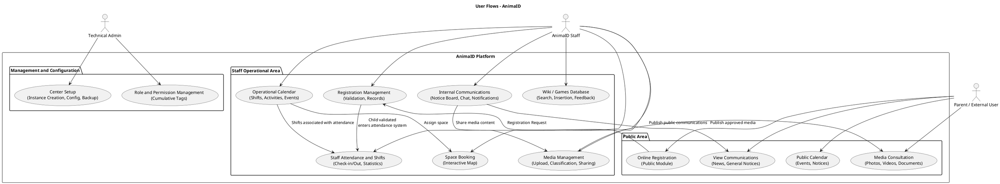
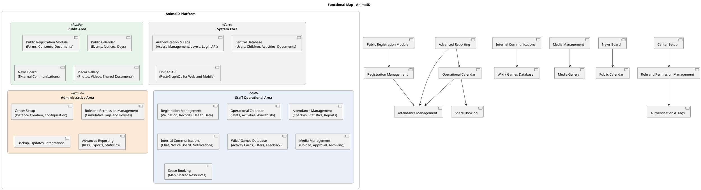
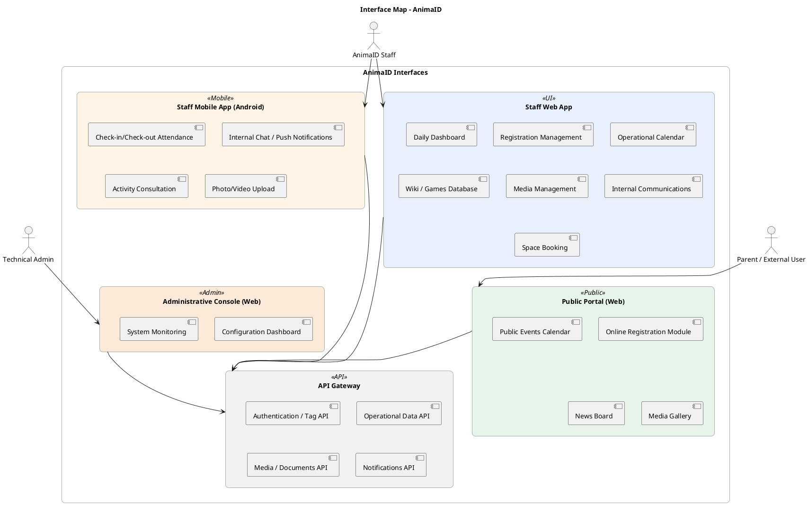
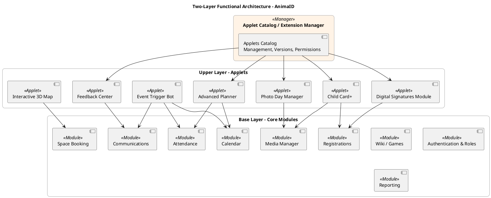

# 🌀 AnimaID — Functional Architecture Document

---

## 📘 1. Introduction

**AnimaID** is a management and coordination platform for **animation centers**, **educational labs**, and **recreational activities**.
Its goal is to provide a **unified digital environment** to coordinate staff, organize activities, manage attendance, registrations, and communications, while also offering a public window accessible to parents and families.

The system is designed to be:

* **Scalable** and easily adaptable to multiple centers (multi-deployment)
* **Extensible** through a modular *Applets* system
* **Accessible** from web and mobile devices
* **Containerizable and portable** in cloud or on-premise environments

---

## 🎯 2. Vision and Objectives

### Main Objectives

1. Digitize the management of animation centers.
2. Provide a single interface for coordinators, animators, and managers.
3. Offer parents simple and immediate access to information, calendars, and registrations.
4. Create a modular, extensible, and customizable ecosystem.

### Secondary Objectives

* Promote collaboration and sharing of best practices.
* Centralize media, documents, and content.
* Automate operational processes (notifications, reports, statistics).
* Provide analysis tools to optimize resources and shifts.

---

## 👥 3. User Types

### **1. Technical Admins**

Manage the platform at a systemic level:

* Creation and configuration of the center instance.
* Role management, permissions, backups, and updates.
* Supervision and system diagnostics.

### **2. AnimaID Staff**

Operational center personnel, organized in levels of responsibility:

* `@organizzatore`
* `@responsabile`
* `@animatore`
* `@aiutoanimatore`

Each level has **cumulative tags**, which determine progressive access to modules.

### **3. Parents / External Users**

Do not require permanent login.
Can:

* Consult the public calendar.
* Register their children.
* View approved communications and media.

---

## 🧩 4. Functional Architecture

AnimaID is built on **functional modules** (system core) that cooperate through internal APIs.
Each module represents an autonomous functional domain, but integrated into the overall flow.

### **Main Modules List**

* **Registrations and Records**
* **Public and Operational Calendar**
* **Attendance and Shifts**
* **Communications (internal and public)**
* **Wiki / Games Database**
* **Media & Document Explorer**
* **Space Booking and Map**
* **Reporting and KPIs**
* **Role and Permission Management**
* **Center Configuration and Setup**

---

## 🔄 5. User Flows

UML diagram showing interactions between the three user categories and main modules.



---

## 🗺️ 6. Functional Map

Representation of modules and their logical interconnections.



---

## 💻 7. Interface Map

Representation of user interfaces and the contact point between users and system.



---

## 🧱 8. Two-Layer Architecture: Modules and Applets



---

## ⚙️ 9. Applets Catalog and Extension Logics

### Example Manifest

```yaml
id: applet.feedback_center
name: Feedback Center
description: Collection of feedback from parents and staff
dependencies:
  - module: communications
  - module: wiki
permissions:
  - read: communications
  - write: feedback
entrypoint: /applets/feedback
```

### Key Features

* Centralized management in the **Applets Catalog**
* Each applet defines **dependencies on modules** and **required permissions**
* **Hot-pluggable system**: applets can be activated/deactivated without interrupting service
* Possibility of **external catalog (marketplace)** for distribution

---

## 🛠️ 9.5. Tech Stack

### Core Technologies

* **Database**: SQLite - Lightweight, file-based database suitable for multi-deployment and portability
* **Backend**: PHP - Server-side scripting for business logic, API endpoints, and module interactions
* **Frontend**: HTML5, TailwindCSS, FontAwesome - Responsive web interfaces with utility-first CSS and icon library
* **Client-side Scripting**: JavaScript (Vanilla) - Interactive functionality for web and mobile interfaces

### Optional Extensions

* **JavaScript Frameworks**: Vue.js or React (for complex UI components in applets)
* **PHP Libraries**: 
  - Composer for dependency management
  - Slim Framework or Laravel for API routing and structure
  - PDO for database abstraction
  - JWT for authentication tokens
  - PHPMailer for email notifications

### Infrastructure

* **Containerization**: Docker - For portable deployments across cloud/on-premise environments
* **Web Server**: Nginx or Apache - Serving static assets and proxying to PHP-FPM
* **Version Control**: Git - For collaborative development and deployment
* **Build Tools**: npm/yarn for frontend asset compilation, Composer for PHP dependencies

### Mobile Considerations

* **Hybrid Mobile App**: Capacitor or Cordova with web technologies for Android staff app
* **Progressive Web App (PWA)**: For enhanced mobile experience on public portal

This tech stack ensures:
- **Lightweight deployment** with SQLite's zero-configuration nature
- **Rapid development** using familiar web technologies
- **Scalability** through modular PHP architecture and containerization
- **Extensibility** via the applets system and optional JS frameworks

---

## 🔮 10. Conclusion and Future Vision

**AnimaID** is not just a management system, but a *modular ecosystem* designed to grow with the needs of animation centers.
The division between **core modules** and **applets** allows:

* high customization for each structure,
* agile feature management,
* technological evolution without invasive migrations.

**Possible Evolutions:**

* Internal **App Store system**
* Integration with educational platforms and digital payments
* Support for **public APIs** for external partners
* Automations via **event triggers**
* Predictive analytics to optimize planning

---

# 🏁 End of Document

*Document drafted for the architectural and functional design of the AnimaID system.*
Version: **0.9 — Draft Functional Architecture (October 2025)**
